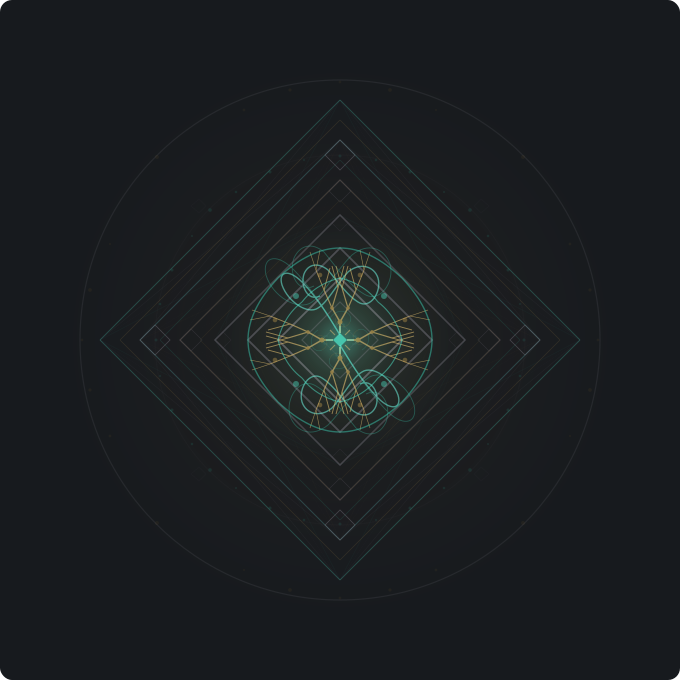

<p align="center">
  
</p>

<h1 align="center">dualmirakl</h1>

<p align="center">
  <a href="https://github.com/Giansn/dualmirakl/actions/workflows/codeql.yml"></a>
  
  
  
  <a href="https://github.com/Giansn/dualmirakl/blob/runpod/funding.json"></a>
</p>

Multi-GPU vLLM orchestration framework for large-scale agent-based simulation research. Domain-agnostic YAML scenarios, dual vLLM backends, optional **FLAME GPU 2** population amplifier, and a full analysis pipeline (ensemble runs, ABC calibration, sensitivity analysis, neural surrogates).

## Architecture

```
GPU 0 — vLLM authority :8000    reasoning / observer agents
GPU 1 — vLLM swarm     :8001    generative / persona agents
GPU 2 — FLAME GPU 2             population dynamics (optional)
CPU   — gateway         :9000    e5-small-v2 embeddings + proxy + UI
```

Deploys on RunPod (2x RTX PRO 4500 Blackwell, 32 GB VRAM each). Orchestrator uses httpx HTTP/2 async with GPU Harmony stream-and-score pipeline.

## Quick Start

```bash
bash scripts/go.sh                                             # one command: setup + start (idempotent)
python -m simulation.sim_loop --scenario scenarios/social_dynamics.yaml  # run
python -m simulation.scenario validate scenarios/foo.yaml      # validate (no GPU)
python -m pytest tests/ -v                                     # 705 tests
```

Or step by step: `bash scripts/setup.sh` then `bash scripts/start_all.sh`. Status: `bash scripts/go.sh --status`.

## Scenario System

All domain logic lives in `scenarios/*.yaml` — swap one file, run a different domain:

| Scenario | Domain |
|----------|--------|
| `social_dynamics.yaml` | Behavioral dynamics + observer intervention (default) |
| `network_resilience.yaml` | Infrastructure failure cascading |
| `market_ecosystem.yaml` | Trader agent herd dynamics |
| `nash_pricing.yaml` | Nash pricing dynamics |
| `minimal.yaml` | Hello World (2 agents, 3 ticks) — setup verification |
| `_template.yaml` | Annotated reference for new scenarios |

Each YAML configures: agents, archetypes, actions, scoring (EMA/logistic), transitions, memory, safety, topologies, FLAME, and environment.

## Simulation Engine

**Tick loop** (6 phases with GPU/CPU overlap):

```
Pre     persona injection (memory + archetype)
A       batch stimuli (environment -> participants)
B       concurrent participant responses (swarm)
C+D     overlap: CPU scoring + GPU observer analysis/intervention
E       event stream -> graph memory update
F       FLAME population dynamics (optional)
```

**Scoring** — EMA (`score += d*alpha*(signal-score)`) or logistic mode. Per-agent heterogeneity via Beta-distributed susceptibility/resilience. Optional peer coupling (kappa).

**Subsystems** — event stream, typed action schemas, per-agent semantic memory (DuckDB), safety gates (ANALYSE/INTERVENE + AUTO/REVIEW/APPROVE tiers), ReACT multi-step observer, real-time graph memory, dual-environment topologies, LLM ontology generator, transition function registry.

**Export** — `data/{run_id}/`: config, trajectories, observations, interventions, event stream, memories, FLAME snapshots.

## GPU Harmony

Stream-and-score dual-GPU execution orchestrator (v5). Manages the full tick pipeline — stimulus generation on GPU 0, concurrent response collection on GPU 1, real-time embedding/scoring on CPU, observer analysis on GPU 0, and optional FLAME dynamics on GPU 2. Adaptive load balancing across backends.

## FLAME GPU 2

Optional population amplifier on GPU 2. Scales N LLM participants (typically 4-16) to **10,000-100,000+ reactive agents** via CUDA RTC spatial messaging — without proportional LLM cost. A single RTX 4500 (32 GB) comfortably handles 100K agents at sub-second step times.

```
dualmirakl (Phases A-E)              FLAME GPU 2 (Phase F)
+-----------------------+            +--------------------------------+
| N LLM participants    |-- bridge ->| N influencer agents (1:1 map)  |
| produce scores via    |            | seed N_pop population agents   |
| vLLM backends         |<- bridge --| (10K default, Beta traits)     |
|                       |            | spatial messaging + peer kappa |
| WorldState updated    |            | EMA/logistic + RTC CUDA C++   |
| with pop. stats       |            | sub-stepped (default 10/tick)  |
+-----------------------+            +--------------------------------+
```

**Enable** via env var or scenario YAML:

```bash
export FLAME_ENABLED=1
```

```yaml
flame:
  enabled: true
  population_size: 10000    # reactive agents
  kappa: 0.05               # coupling strength
  influencer_weight: 0.8    # signal amplification
  sub_steps: 4              # FLAME steps per tick
```

**Components** (`simulation/flame/`):

| File | Purpose |
|------|---------|
| `engine.py` | FlameEngine — pyflamegpu wrapper (init, step, get/set state) |
| `bridge.py` | FlameBridge — bidirectional data shuttle (scores <-> population stats) |
| `models.py` | FLAME model description (RTC agent functions, spatial messaging) |
| `macros.py` | FLAME GPU 2 macro functions for population-level operations |
| `flame_setup.py` | Boot sequence — auto-configures engine + W&B + Optuna |

**Per-tick output** — `PopulationSnapshot`: mean/std/min/max scores, 10-bin histogram, influencer scores, spatial clustering metric. Exported to `flame_population.json`.

All FLAME dependencies are optional — graceful fallback when `pyflamegpu` is missing.

## Ensemble Runs & Calibration

**Ensemble** — Multi-run orchestrator with early stopping via coefficient-of-variation convergence detection. Produces percentile bands and variance decomposition (epistemic/aleatory). Supports nested Monte Carlo and evolutionary ensemble modes.

**ABC Calibration** — Likelihood-free Bayesian inference via ABC-SMC (Toni et al. 2009). Generates posterior distributions over scenario parameters with adaptive epsilon thresholds and Gaussian perturbation kernels. Includes history-matching pre-filtering (NROY).

**Neural Surrogate** — Dual Gaussian Process / MLP surrogate trained on synthetic data, with automatic winner selection. Provides predictions + confidence intervals for Optuna acceleration and SHAP-based parameter importance.

**Trajectory Forecaster** — Online score forecasting with NeuralProphet (fallback: linear extrapolation). Detects changepoints, decomposes trends, predicts threshold crossings for observer context injection.

## Sensitivity Analysis

**Morris screening** for fast parameter importance ranking, **Sobol S1+S2** for quantitative indices, **history matching** (NROY) to rule out implausible parameter regions. Full pipeline: Morris -> NROY -> Sobol. Intervention threshold calibration via embedding similarity F1-optimization.

## Analysis Toolkit

`simulation/dynamics.py` — 8 modules on score trajectories (no GPU needed):

| Module | Analysis |
|--------|----------|
| A | Coupled ODE (emergent synchronization) |
| B | Bifurcation sweep (parameter transitions) |
| C | Lyapunov exponents (chaos detection) |
| D | Sobol sensitivity S1+S2 (parameter importance) |
| E | Transfer entropy (directed information flow) |
| F | Emergence index (system-level novelty) |
| G | Attractor basins (state-space geometry) |
| H | Stochastic resonance (noise-induced order) |

Post-sim ReACT analysis via `POST /simulation/analyse`.

## Knowledge Pipeline

Documents -> chunking + e5-small-v2 embedding -> GraphRAG extraction (authority) -> DuckDB storage (FLOAT[384] vectors) -> context injection at tick 0 -> graph memory seeding -> ReACT observer queries.

Persistent DuckDB tables: `entities`, `relations`, `agent_memories`, `generated_personas`, `analysis_reports`.

## Gateway API

FastAPI on port 9000. Full endpoint reference:

**LLM / Embedding**

| Method | Path | Description |
|--------|------|-------------|
| POST | `/v1/chat/completions` | vLLM proxy (authority/swarm routing) |
| POST | `/v1/embeddings` | e5-small-v2 embedding |
| GET | `/v1/models` | List available models |

**Simulation Control**

| Method | Path | Description |
|--------|------|-------------|
| GET | `/simulation/preflight` | Infrastructure validation |
| POST | `/simulation/start` | Launch single simulation |
| POST | `/simulation/ensemble` | Run ensemble of simulations |
| POST | `/simulation/nested_ensemble` | Nested Monte Carlo ensemble |
| POST | `/simulation/sweep` | Parameter sweep (grid/random) |
| POST | `/simulation/scenario_tree` | Decision tree from ensembles |
| POST | `/simulation/calibrate` | ABC-SMC / history matching |
| GET | `/simulation/calibrate/status` | Calibration progress |
| POST | `/simulation/optimize` | Optuna hyperparameter optimization |
| POST | `/simulation/pipeline` | Full pipeline (ensemble -> calibrate -> optimize) |
| GET | `/simulation/pipeline/result` | Pipeline result |
| GET | `/simulation/pipeline/report` | Pipeline HTML report |
| POST | `/simulation/analyse` | Sensitivity analysis |
| GET | `/simulation/analyse/status` | Analysis progress |
| GET | `/simulation/analyse/report` | Analysis HTML report |
| GET | `/simulation/status` | Current simulation state |
| GET | `/simulation/results` | List completed runs |
| GET | `/simulation/report` | Aggregated results HTML |

**FLAME GPU 2**

| Method | Path | Description |
|--------|------|-------------|
| GET | `/simulation/flame` | FLAME status |
| POST | `/simulation/flame/activate` | Enable FLAME |
| POST | `/simulation/flame/deactivate` | Disable FLAME |

**Scenarios**

| Method | Path | Description |
|--------|------|-------------|
| GET | `/simulation/scenarios` | List available scenarios |
| POST | `/simulation/scenarios` | Create/register scenario |
| GET | `/simulation/detect` | Detect scenario from context |

**Documents & Knowledge Graph**

| Method | Path | Description |
|--------|------|-------------|
| POST | `/v1/documents` | Upload documents |
| GET | `/v1/documents` | List documents |
| DELETE | `/v1/documents` | Delete all documents |
| POST | `/v1/documents/query` | Semantic search |
| POST | `/v1/documents/extract_graph` | Extract knowledge graph |
| GET | `/v1/graph` | Retrieve graph |
| DELETE | `/v1/graph` | Clear graph |
| POST | `/v1/graph/query` | Query graph |

**Memories & Interview**

| Method | Path | Description |
|--------|------|-------------|
| GET | `/v1/memories` | List session memories |
| GET | `/v1/memories/{run_id}` | Run-specific memories |
| POST | `/v1/interview` | Multi-turn agent interview |

**System**

| Method | Path | Description |
|--------|------|-------------|
| GET | `/health` | Health check |
| GET | `/system/status` | System configuration |
| POST | `/system/setup` | Configure vLLM servers |
| POST | `/system/start` | Start vLLM services |
| POST | `/system/stop` | Stop vLLM services |
| GET | `/gpu/telemetry` | Real-time GPU metrics |

**Dashboards**: `/` (main UI) | `/gpu` (GPU monitor) | `/pipeline` (pipeline visualization)

## Deployment

```bash
bash scripts/go.sh                                   # RunPod: one-command setup + start
docker compose -f docker/docker-compose.yml up -d     # Docker Compose
docker pull giansn/dualmirakl:runpod-cu128            # or pull directly (:latest also available)
```

Entrypoint modes: `all|authority|swarm|gateway|sim|shell`. Requires CUDA 12.9 for Blackwell (sm_120). See [docs/DOCKER.md](docs/DOCKER.md).

## Models

| Slot | Model | GPU | Port |
|------|-------|-----|------|
| authority | Mistral Nemo Instruct 12B FP8 | 0 | 8000 |
| swarm | Nemotron Nano 30B (NVFP4) | 1 | 8001 |
| embedding | e5-small-v2 | CPU | — |

Swap a model: edit `config/<slot>.env`. Nothing else changes.

## Dependencies

**Core**: vLLM, FastAPI, httpx, sentence-transformers, NeuralProphet, DuckDB, Pydantic, pynvml

**Optional**: pyflamegpu (FLAME GPU 2), wandb (tracking), optuna (optimization), JAX + NumPyro (Bayesian), SALib + nolds (advanced SA)

## License

AGPL-3.0-or-later. See [LICENSE](LICENSE).

<p align="center">
  <a href="https://buy.stripe.com/eVqbJ3eES9hY48edZpbZe00">Support this project</a>
</p>
